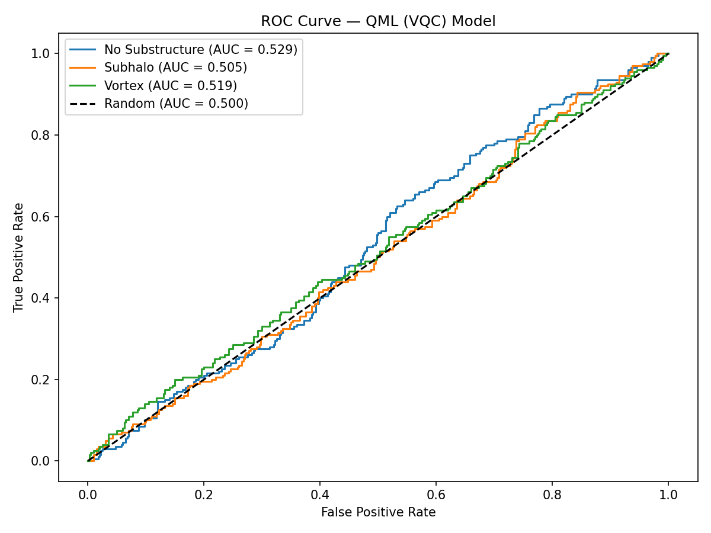

# DeepLense QML — GSoC 2026 | ML4Sci
## Quantum Machine Learning for Dark Matter Substructure Classification

Classifying strong gravitational lensing images into three dark matter 
substructure categories using hybrid quantum-classical models built with PennyLane.

---

## Problem Statement
Strong gravitational lensing encodes signatures of dark matter substructure 
in the distortion patterns of background light. This project classifies 
lensing images into three categories:

| Label | Class | 
|---|---|
| 0 | No Substructure |
| 1 | Subhalo Substructure |
| 2 | Vortex Substructure |

---

## Results

### Model Comparison
| Model | Accuracy | Mean AUC | Training Time |
|---|---|---|---|
| Random Forest + PCA(200) | 41.1% | 0.594 | ~2 min |
| VQC 8 qubits + PCA(8) | ~34% | 0.518 | 52.6 min |
| VQC 16 qubits + PCA(16) | ~35% | 0.520 | 158.4 min |
| CNN-QML Hybrid | TBD | TBD | TBD |

### ROC Curves
| Classical Baseline | QML Model | QML Model (16 QUBITS)
|---|---|---|
|  |  |  |

---

## Key Findings
- Classical RF baseline achieves mean AUC of 0.594 on PCA-reduced pixel features
- VQC with 8 qubits achieves mean AUC of 0.518 — near random but above baseline
- Increasing to 16 qubits marginally improves AUC (0.518 → 0.520), suggesting
  qubit count is not the primary bottleneck
- PCA encoding loses spatial structure critical for lensing classification —
  motivating the CNN-QML hybrid approach


---

## Architecture

### Quantum Circuit
- **Encoding**: AngleEmbedding (Y-rotations) — maps PCA features to qubit angles
- **Variational layer**: StronglyEntanglingLayers — full qubit entanglement
- **Measurement**: Pauli-Z expectation values on 3 qubits
- **Training**: Parameter shift rule via PennyLane-PyTorch interface

### Hybrid Pipeline
```
Raw Image (150x150)
       ↓
  Resize to 32x32
       ↓
  Flatten (1024-dim)
       ↓
  PCA (8 or 16 dims)
       ↓
  Scale to [-π, π]
       ↓
  AngleEmbedding → StronglyEntanglingLayers → PauliZ measurement
       ↓
  Linear head (3 logits)
       ↓
  CrossEntropyLoss
```

---

### Dataset
DeepLense dataset — not included due to size.
Available via ML4Sci: https://ml4sci.org

---

## Evaluation Metrics
All models evaluated using:
- **ROC curve** (one-vs-rest, per class)
- **AUC score** (primary metric)
- Per-class precision, recall, F1-score

---

## Author
**Prathik M Nambiar**  
B.E. Computer Science and Engineering  
PES University, Bangalore  
GSoC 2026 — ML4Sci Specific Test III: Quantum ML

---

## References

**Quantum Machine Learning**
- Schuld, M. & Petruccione, F. (2021). *Machine Learning with Quantum Computers*. Springer.
- Cerezo et al. (2021). Variational Quantum Algorithms. *Nature Reviews Physics*.
- McClean et al. (2018). Barren Plateaus in Quantum Neural Network Training. *Nature Communications*.
- Schuld et al. (2020). Circuit-centric Quantum Classifiers. *Physical Review A*.

**DeepLense / Gravitational Lensing**
- Hezaveh et al. (2017). Fast Automated Analysis of Strong Gravitational Lensing with CNNs. *Nature*.
- Varma et al. (2020). DeepLense: Deep Learning for Strong Gravitational Lens Analysis. *ML4Sci*.

**Frameworks and Tools**
- PennyLane: Bergholm et al. (2018). PennyLane: Automatic Differentiation of Hybrid Quantum-Classical Computations. [arXiv:1811.04968](https://arxiv.org/abs/1811.04968)
- PyTorch: Paszke et al. (2019). PyTorch: An Imperative Style, High-Performance Deep Learning Library. *NeurIPS*.
- Scikit-learn: Pedregosa et al. (2011). Scikit-learn: Machine Learning in Python. *JMLR*.

**Demos and Documentation**
- PennyLane Variational Classifier Demo: https://pennylane.ai/qml/demos/tutorial_variational_classifier
- ML4Sci DeepLense Project: https://ml4sci.org
