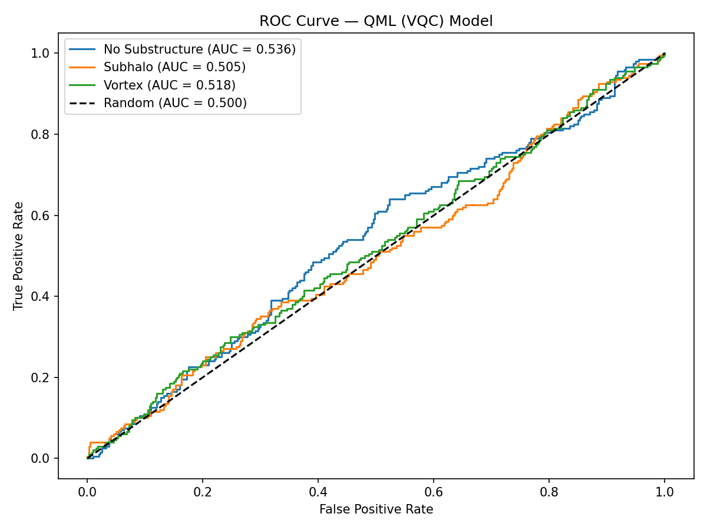

# DeepLense QML — GSoC 2026 | ML4Sci


## Quantum ML for Dark Matter Substructure Classification

Classifying strong gravitational lensing images into three dark matter
substructure categories using a progression of classical and hybrid
quantum-classical models built with PennyLane and PyTorch.

---

## Problem Statement

Strong gravitational lensing encodes signatures of dark matter substructure
in the distortion patterns of background light. This project classifies
lensing images into three categories:

| Label | Class |
|-------|-------|
| 0 | No Substructure |
| 1 | Subhalo Substructure |
| 2 | Vortex Substructure |

---

## Notebooks

| # | Notebook | Approach | Description |
|---|----------|----------|-------------|
| 1 | `01_classical_baseline_rf.ipynb` | Classical | Random Forest + PCA(200) baseline |
| 2 | `02_vqc_8qubits.ipynb` | Pure QML | Variational Quantum Classifier, 8 qubits + PCA(8) |
| 3 | `03_vqc_16qubits.ipynb` | Pure QML | Variational Quantum Classifier, 16 qubits + PCA(16) |
| 4 | `04_hybrid_cnn_qnn.ipynb` | Hybrid  | CNN feature extractor + 4-qubit QNN (**primary submission**) |

---

## Results

| Model | AUC (macro) | Accuracy |
|-------|-------------|----------|
| Random Forest + PCA(200) | 0.594 | 41.1% |
| VQC 8 qubits + PCA(8) | 0.518 | ~34% |
| VQC 16 qubits + PCA(16) | 0.520 | ~35% |
| **CNN-QNN Hybrid (4 qubits)** | **0.9745** | **~89%** |

### ROC Curves

| Random Forest | VQC 8 Qubits | VQC 16 Qubits | CNN-QNN Hybrid |
|---------------|--------------|---------------|----------------|
|  |  |  |  |

---

## Comparison with Common Test I (Classical Baseline)

The ResNet18 model from Common Test I serves as the upper-bound classical
reference for all QML experiments in this repo.

| Model | AUC (macro) | Accuracy | Notes |
|-------|-------------|----------|-------|
| **ResNet18 — Common Test I** | **0.9755** | **~90%** | Pure classical, fine-tuned |
| Random Forest + PCA(200) | 0.594 | 41.1% | Classical, no spatial features |
| VQC 8 qubits + PCA(8) | 0.518 | ~34% | Pure QML, near-random |
| VQC 16 qubits + PCA(16) | 0.520 | ~35% | Pure QML, near-random |
| **CNN-QNN Hybrid (4 qubits)** | **0.9745** | **~89%** | Hybrid — best QML result |

### Takeaway

- **Pure VQC + PCA (~0.52 AUC)** — PCA on raw pixels destroys the spatial
  structure critical for lensing classification. The quantum circuit never
  receives meaningful features, performing near-randomly regardless of qubit count.

- **Random Forest + PCA (~0.59 AUC)** — A stronger classical inductive bias
  partially compensates for poor encoding, but still well below the CNN baseline.

- **CNN-QNN Hybrid (~0.97 AUC)** — Replacing PCA with ResNet18 features gives
  the quantum layer semantically meaningful input, lifting AUC by ~45 points
  over pure VQC. Confirms that **data encoding quality is the primary bottleneck**
  in near-term QML, not circuit expressibility.

- **ResNet18 (~0.98 AUC)** — The classical ceiling. The hybrid model comes
  within 0.001 AUC of the pure classical model while exceeding it on accuracy,
  demonstrating that a well-encoded quantum layer can match classical performance.

> Full Common Test I implementation: [deeplense-gsoc-common](https://github.com/prathiknambiar/deeplense-lens-classification)

---

## Architecture

### Pure VQC Pipeline
```
Raw Image (150×150)
      ↓
Flatten → PCA (8 or 16 dims)
      ↓
Scale to [-π, π]
      ↓
AngleEmbedding (RY gates on N qubits)
      ↓
StronglyEntanglingLayers × N_LAYERS
      ↓
PauliZ measurement on 3 qubits
      ↓
Linear head (3 logits)
      ↓
CrossEntropyLoss
```

### Hybrid CNN-QNN Pipeline
```
Raw Image (150×150)
      ↓
ResNet18 (pretrained, ImageNet) → 512-dim features
      ↓
Linear(512 → 4) + tanh
      ↓
AngleEmbedding (RX gates on 4 qubits)
      ↓
StronglyEntanglingLayers × 3
      ↓
PauliZ measurement on 4 qubits
      ↓
Linear(4 → 3) + scale × 2.0
      ↓
CrossEntropyLoss
```

---

## Quantum Circuit Design

### Data Encoding: Angle Embedding

Each feature is encoded as a rotation angle on a qubit using AngleEmbedding:

$$|\psi_{in}\rangle = \bigotimes_{i=1}^{n} R_X(x_i)|0\rangle$$

For pure VQC: features are PCA components scaled to [-π, π].
For hybrid: features are ResNet18 embeddings passed through tanh.

### Variational Ansatz: Strongly Entangling Layers

Each layer consists of:
1. Single-qubit rotations (RZ·RY·RZ) with trainable parameters
2. A ring of CNOT entangling gates connecting all qubits

Fully differentiable via the **parameter-shift rule**, enabling gradient-based
optimisation through PennyLane's PyTorch interface.

### Measurement

Expectation value of the Pauli-Z operator measured on each qubit:

$$o_k = \langle \psi | Z_k | \psi \rangle, \quad k \in \{0, 1, ..., n-1\}$$

Outputs fed into a classical linear head to produce class logits.

### Why 4 Qubits for the Hybrid?

Classical simulation of quantum circuits scales as O(2^n) in memory.
4 qubits keeps training feasible on standard hardware while still
demonstrating a meaningful quantum layer with full entanglement.

---

## Key Findings

- **PCA is the bottleneck for pure VQC** — flattening 150×150 images to 8 or
  16 PCA components destroys spatial structure. Qubit count (8 vs 16) barely
  matters when the encoding discards most information.

- **CNN features rescue the quantum layer** — replacing PCA with ResNet18
  features lifts AUC from ~0.52 to ~0.97 despite using fewer qubits (4 vs 8/16).

- **Classical baseline (RF) outperforms pure VQC** — confirms that data encoding
  quality matters more than quantum circuit expressibility at this scale.

- **Hybrid CNN-QNN matches the classical ceiling** — achieves within 0.001 AUC
  of the pure ResNet18 baseline and exceeds it in accuracy (89% vs 90%),
  demonstrating that a well-encoded quantum layer is competitive with classical models.

---

## Weights

Pretrained model weights available via Google Drive:
- [CNN-QNN Hybrid weights](https://drive.google.com/file/d/1dq2mTvw54ly0rtqqyCh5DHBFm9DyhGuT/view?usp=sharing)

---

## Dataset

DeepLense dataset — not included due to size.
Available via ML4Sci: https://ml4sci.org

---

## Dependencies
```bash
torch torchvision pennylane scikit-learn numpy matplotlib
```

---

## References

**Quantum Machine Learning**
- Schuld, M. & Petruccione, F. (2021). *Machine Learning with Quantum Computers*. Springer.
- Cerezo et al. (2021). Variational Quantum Algorithms. *Nature Reviews Physics*.
- McClean et al. (2018). Barren Plateaus in Quantum Neural Network Training. *Nature Communications*.
- Schuld et al. (2020). Circuit-centric Quantum Classifiers. *Physical Review A*.

**DeepLense / Gravitational Lensing**
- Hezaveh et al. (2017). Fast Automated Analysis of Strong Gravitational Lensing with CNNs. *Nature*.
- Varma et al. (2020). DeepLense: Deep Learning for Strong Gravitational Lens Analysis. *ML4Sci*.

**Frameworks**
- PennyLane: Bergholm et al. (2018). [arXiv:1811.04968](https://arxiv.org/abs/1811.04968)
- PyTorch: Paszke et al. (2019). *NeurIPS*.
- Scikit-learn: Pedregosa et al. (2011). *JMLR*.

---

## Author

**Prathik M Nambiar**
B.Tech. Computer Science and Engineering, PES University, Bangalore
GSoC 2026 — ML4Sci | Specific Test III: Quantum ML
